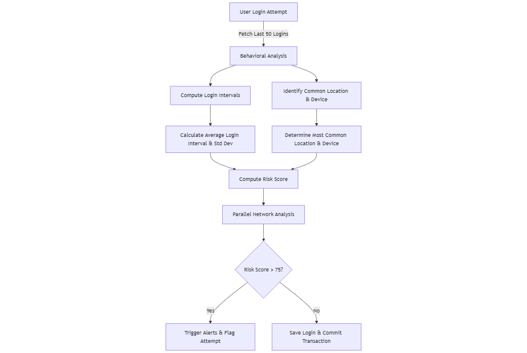

# **Real-Time Phishing Detection Using Behavioral Analysis**  

## **Overview**  
This project implements **real-time phishing detection** using **behavioral analysis** in Golang. It analyzes user login patterns, device consistency, IP reputation, and time-based behavior to **identify anomalies** and **detect phishing attempts**.  

The system integrates **GORM with MySQL**, employs **concurrent risk analysis**, and triggers **real-time security alerts** (Slack, Email) for suspicious login attempts.

---

## **Features**  
  **Behavioral Baseline Analysis:** Tracks user login frequency, device usage, and location patterns.  
  **Real-Time Anomaly Detection:** Identifies phishing attempts based on login behavior, GeoIP, and network heuristics.  
  **Parallel Network Analysis:** Detects VPNs, Tor networks, and malicious IPs using concurrent processing.  
  **Risk Scoring System:** Assigns a **risk score** to each login attempt based on heuristics.  
  **Security Alerts:** Sends **real-time notifications** to Slack and Email for high-risk logins.  
  **Database Transaction Management:** Uses **GORM transactions** to ensure login attempt data integrity.  

---

## **Architecture**  

### ** Behavioral Analysis Flow**  



### **Risk Analysis Components**  
- **Behavioral Anomaly Detection:**  
  - Unusual **time intervals** between logins.  
  - New or uncommon **devices** used.  
  - Drastic **GeoIP changes**.  
- **Network-Based Heuristics:**  
  - Multiple logins from **different IPs** within a short time.  
  - Detection of **VPNs, Tor nodes, malicious IPs**.  
  - **High-frequency logins** in a short span.  
- **Phishing Indicators:**  
  - **OTP Replay Attacks** (identical OTP reuse).  
  - Sudden **location jumps** (impossible travel speed).  

---

## **Installation & Setup**  

### **Prerequisites**  
- **Go 1.23**  
- **MySQL** (for storing login attempts)  

### ** Clone the Repository**  
```sh
git clone https://github.com/yourusername/phishing-detection.git
cd phishing-detection
```

### ** Install Dependencies**  
```sh
go mod tidy
```

### ** Configure Environment Variables**  
Create a `.env` file:  
```env
DB_USER=root
DB_PASS=yourpassword
DB_HOST=localhost
DB_NAME=phishing_detection

```

### ** Run the Service**  
```sh
go run main.go
```

---

## **Code Documentation**  

### ** `DetectPhishing` Function**  
Handles **real-time phishing detection** by analyzing login behavior and network patterns.  

**Steps:**  
1. Fetch **last 50 login attempts** for the user.  
2. Compute **behavioral baselines** (average login interval, device usage, location trends).  
3. Compute **risk score** based on behavior and heuristics.  
4. Run **network-based analysis** (VPNs, malicious IPs, Tor detection).  
5. If **risk score > 75**, trigger **real-time alerts**.  
6. Save the login attempt securely using **GORM transactions**.  


---

### ** `CalculateBehavioralBaselines` Function**  
Analyzes past user logins to establish **normal behavior**.  

**Metrics Computed:**  
- **Average login interval**  
- **Standard deviation of login intervals**  
- **Most common location**  
- **Most common device**  


---

### ** `ComputeRiskScore` Function**  
Assigns a **risk score** to a login attempt based on:  
- **GeoIP distance from last login**  
- **OTP replay detection**  
- **Device mismatch**  
- **Unusual login time**  


---

### ** `PerformNetworkAnalysis` Function**  
Executes **parallel network-based heuristics** to detect:  
- **High-frequency logins**  
- **Multiple IPs in a short duration**  
- **Malicious IPs, VPNs, and Tor nodes**  


---

### ** `SendSecurityAlerts` Function**  
Sends **real-time alerts** for high-risk logins via **Slack & Email**.  


---

## **Risk Score Calculation Table**  

| **Risk Factor**             | **Risk Score Contribution** |
|-----------------------------|----------------------------|
| **GeoIP Distance > 5000km** | +30                        |
| **GeoIP Distance > 1000km** | +15                        |
| **OTP Replay Detected**     | +40                        |
| **New Device Used**         | +25                        |
| **Unusual Login Time**      | +20                        |
| **Multiple IPs in 1 Hour**  | +20                        |
| **High Login Frequency**    | +20                        |
| **Malicious IP Detected**   | +50                        |
| **VPN Detected**            | +15                        |
| **Tor Node Detected**       | +30                        |

**Trigger Alert:** If **risk score > 75**.

---

## **Testing & Validation**  

### **1️⃣ Unit Testing**  
Run **unit tests** to validate behavior detection and risk scoring:  
```sh
go test ./...
```

### **2️⃣ Simulate Phishing Attack**  
1. Attempt multiple logins from **different locations**.  
2. Use **VPN/Tor** to simulate IP obfuscation.  
3. Replay an **old OTP code** to trigger **OTP replay detection**.  
4. Check **Slack/Email alerts** for warnings.  

---


## **Future Enhancements**  
🔹 **Machine Learning Models** for anomaly detection.  
🔹 **Adaptive Risk Scoring** based on real-world attack data.  
🔹 **Integration with SIEM** for enterprise-wide monitoring.  

---


